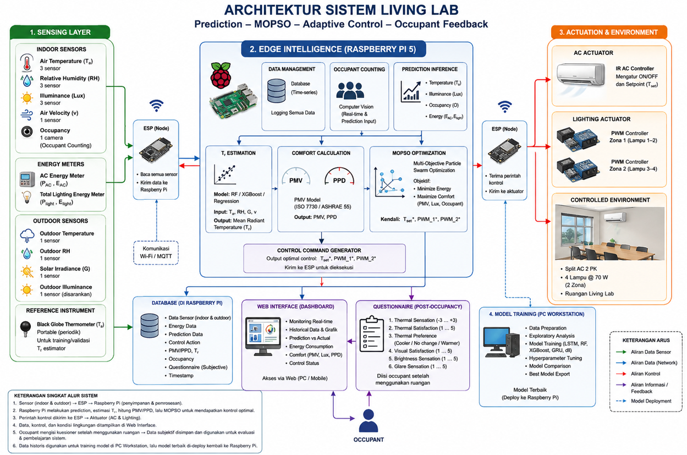

# Living Lab — Adaptive Thermal & Lighting Control

Predictive, MOPSO-optimized adaptive control system for indoor thermal comfort and lighting energy, with occupant feedback loop.

## Overview

Sensor data (indoor/outdoor temperature, humidity, illuminance, air velocity, occupancy, energy) is collected by ESP nodes and streamed to a Raspberry Pi 5 edge unit over Wi-Fi/MQTT. The Pi predicts indoor conditions, estimates mean radiant temperature, computes thermal comfort (PMV/PPD per ISO 7730 / ASHRAE 55), and runs Multi-Objective Particle Swarm Optimization (MOPSO) to find control setpoints that minimize energy use while maximizing comfort. Optimal commands (AC setpoint, lighting PWM per zone) are sent back to actuator ESP nodes. All data is logged, visualized on a web dashboard, and occupants submit a post-occupancy questionnaire used to refine the models — trained offline on a PC workstation and redeployed to the Pi.

## System layers

| Folder | Layer |
|---|---|
| [`sensing/`](sensing/) | Sensing Layer — indoor/outdoor sensors, energy meters, ESP node |
| [`edge-intelligence/`](edge-intelligence/) | Edge Intelligence — Raspberry Pi 5: prediction, PMV/PPD, MOPSO, control generation |
| [`actuation/`](actuation/) | Actuation & Environment — AC + lighting actuators, ESP node |
| [`dashboard/`](dashboard/) | Web dashboard + occupant questionnaire |
| [`model-training/`](model-training/) | Offline model training (PC workstation) |
| [`data/`](data/) | Local data storage (not tracked in git) |
| [`docs/`](docs/) | Architecture diagram and reference docs |

## Data flow

1. Sensors (indoor/outdoor) → ESP → Raspberry Pi (storage & processing)
2. Raspberry Pi predicts indoor conditions, estimates Tr, computes PMV/PPD, runs MOPSO for optimal control
3. Control commands sent to ESP → actuators (AC, lighting)
4. Data, control actions, and environment state shown on web dashboard
5. Occupant fills questionnaire after room use → stored for evaluation & learning
6. Historical data used to train models on PC workstation; best model redeployed to Raspberry Pi

See [docs/architecture.png](docs/architecture.png) for full diagram.

## Progress

See [docs/journal/](docs/journal/) for the running progress log.
