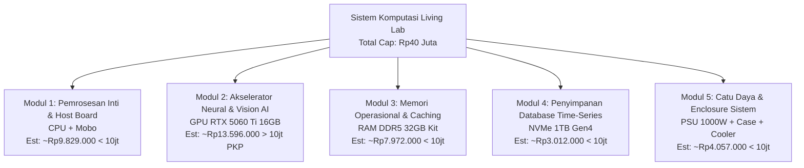

# Checklist Survey ke Youngs Computer — Skema Modul Pendukung

**Tujuan**: Verifikasi stok fisik, harga real (toko offline), dan permintaan *Official Quotation* per modul pendukung sistem komputasi Living Lab untuk kepatuhan SPJ P2M UNS 2026.  
**Referensi**: [pc-workstation-spec.md](pc-workstation-spec.md), [legal-living-lab-spj-p2m-2026.md](legal-living-lab-spj-p2m-2026.md), [katalog/Youngs Componen Retail Price.xlsx](katalog/Youngs%20Componen%20Retail%20Price.xlsx).

---

## 📍 Informasi Toko
* **Nama Toko**: Youngs Computer Jogja
* **Alamat**: Jl. Kaliwaru No 84A, Soropadan XII, Depok, Sleman, D.I. Yogyakarta
* **Kontak WA**: 0838-6730-9810 / 0811-2644-226
* **Jam Operasional**: Senin – Jumat: 09.00 – 20.00 WIB | Sabtu – Minggu: 09.00 – 17.00 WIB
* **Website / Medsos**: www.youngscomputer.com | IG: `@youngscom`

---

## 🎒 Bawa Sebelum Berangkat
- [ ] Softcopy / Printout checklist ini & daftar BoM target
- [ ] Data institusi UNS (Nama Pembeli, NPWP Institusi/LPPM, Alamat Kampus)
- [ ] Meterai Rp10.000 (1–2 lembar cadangan jika ada kuitansi/surat kesanggupan langsung)
- [ ] Budget cap total: **Rp40.000.000** (Estimasi kebutuhan: **~Rp38.466.000**)

---

## 1. Strategi "Skema Modul Pendukung" (Kepatuhan SPJ)

Komponen dirancang sebagai **sub-sistem instrumen penelitian fungsional mandiri** agar pertanggungjawaban SPJ defensible dan memenuhi aturan ambang batas pengadaan:

---

## 2. Rincian Part Target & Alternatif Toko

| Modul & Penamaan SPJ | Komponen Target (Katalog) | Harga Katalog | Alternatif / Cadangan di Toko | Yang Perlu Dicek di Lokasi |
|---|---|---|---|---|
| **Modul 1** *Sub-sistem Pemrosesan Inti & Host Board* | • AMD Ryzen 7 9700X **Tray** • ASROCK X870 Pro RS / Challenger WIFI | • CPU: Rp5.379.000 • Mobo: Rp4.189.000 – Rp4.450.000 **Subtotal: ~Rp9.568.000 – Rp9.829.000** *(< Rp10jt)* | • CPU Box (jika Tray kosong, cek selisih) • Mobo: ASROCK X870 PRO-A (3,84jt) / MSI B650 Gaming Plus (2,98jt) / ASUS Prime X670-P (3,68jt) | [ ] Stok Tray ready fisik? [ ] Mobo X870 ready fisik? [ ] **Verifikasi slot PCIe x16 kedua** (apakah jalur elektriknya min. x4/x8 untuk dual GPU?) |
| **Modul 2** *Modul Akselerasi Neural & Vision AI* | • Colorful RTX 5060 Ti 16GB GAMING DUO-V | **Rp13.596.000** *(> Rp10jt, Wajib PKP & Faktur Pajak)* | • Colorful Battle AX Duo 16GB (13,87jt) • Colorful Ultra W Duo 16GB (14,18jt) • ASUS Dual RTX 5060 Ti 16GB (15,49jt) • MSI RTX 5060 Ti 16GB Ventus 2X (15,61jt) | [ ] Stok 16GB ready fisik / PO berapa hari? [ ] Garansi distributor resmi [ ] **Wajib terbitkan e-Faktur Pajak** |
| **Modul 3** *Modul Memori Operasional Sistem* | • Kingston DDR5 Fury Beast Black 32GB Kit (2x16GB) 5600/6000MHz EXPO | **Rp7.972.000** *(< Rp10jt)* | • ADATA XPG Lancer Blade RGB 32GB Kit 6000MHz • Team T-Force Vulcan / Delta DDR5 32GB Kit • Corsair Vengeance DDR5 32GB Kit | [ ] Cek stok kit 2x16GB ready fisik [ ] Profil EXPO (AMD optimized) aktif? [ ] Cek harga real jika ada promo |
| **Modul 4** *Modul Penyimpanan Database Time-Series* | • ADATA Legend 900 1TB NVMe Gen4 (7000MB/s) | **Rp3.012.000** *(< Rp10jt)* | • WD Black SN770 1TB / SN850X 1TB • Samsung 980 Pro / 990 Pro 1TB • Kingston KC3000 1TB | [ ] Varian 1TB ready fisik? [ ] Cek garansi distributor (3-5 tahun) |
| **Modul 5** *Modul Catu Daya & Enclosure Sistem* | • MSI MAG A1000GL 1000W PCIe 5.0 Gold • Casing ATX High-Airflow (Einarex S700 / Montech Air 903 / P800X) • Dual Tower Cooler (Thermalright / DeepCool LE240/AG620) | • PSU: Rp2.557.000 • Case: ~Rp750.000 – Rp1.000.000 • Cooler: ~Rp500.000 – Rp800.000 **Subtotal: ~Rp3.807.000 – Rp4.357.000** *(< Rp10jt)* | • PSU FSP 1000W / Corsair RM1000e • Cooler: DeepCool AK620 / Thermalright Peerless Assassin 120 / LE240 Liquid • Case: Montech Air 1000 / Einarex Prisma S700 | [ ] PSU 1000W PCIe 5.0 kabel modular ready? [ ] Cooler support socket AM5 natively? [ ] Case muat mobo ATX & dual-slot VGA clearance |

---

## 3. Verifikasi Teknis Penting (Tanyakan ke Teknisi/Sales Toko)

1. **Motherboard Dual GPU Compatibility**:
   * Tanyakan: *"Apakah di mobo ASROCK X870 ini, slot PCIe x16 kedua bisa jalan saat GPU pertama terpasang, dan tidak bentrok/dinonaktifkan jika slot M.2 NVMe terpasang?"*
2. **PSU Headroom untuk Upgrade 2 GPU**:
   * Konfirmasi ketersediaan konektor daya PCIe 8-pin / 12V-2x6 untuk skenario ekspansi dual GPU di masa mendatang.
3. **Kompatibilitas Cooler & RAM Clearance**:
   * Pastikan heatsink cooler tidak mentok dengan modul RAM DDR5.

---

## 4. Instruksi Format Dokumen & SPJ ke Toko

Minta pihak Youngs Computer untuk mencetak **Surat Penawaran Harga Resmi (Official Quotation)** dengan pemecahan per paket modul:

* [ ] **Quotation 1**: *"Modul Pemrosesan Inti & Host Board Penelitian"* (CPU + Motherboard) $\rightarrow$ Max ~Rp9,8jt
* [ ] **Quotation 2**: *"Modul Akselerasi Komputasi AI & Machine Learning"* (GPU RTX 5060 Ti 16GB) $\rightarrow$ ~Rp13,6jt *(Wajib PKP & Faktur Pajak)*
* [ ] **Quotation 3**: *"Modul Memori Operasional Sistem Sensor"* (RAM DDR5 32GB Kit) $\rightarrow$ ~Rp7,9jt
* [ ] **Quotation 4**: *"Modul Media Penyimpanan Database Telemetri"* (NVMe 1TB Gen4) $\rightarrow$ ~Rp3,0jt
* [ ] **Quotation 5**: *"Modul Catu Daya & Pengkondisi Lingkungan Komputasi"* (PSU 1000W + Case + Cooler) $\rightarrow$ ~Rp4,0jt

### Ketentuan Dokumen dari Toko:
* Memakai **Kop Surat Resmi** Youngs Computer.
* Memuat rincian: Merk, Tipe Lengkap, Qty, Harga Satuan, Subtotal, Masa Berlaku Penawaran (*validity date*).
* Ada **Tanda Tangan PIC & Stempel Basah Toko**.
* Konfirmasi kesiapan toko menerbitkan **Surat Jalan / Bukti Pengiriman** dan kuitansi bermeterai Rp10.000 (untuk modul > Rp5jt).

---

## 5. Lembar Catatan Hasil Survei (Hasil Lapangan 2026-08-31)

* **Status Stok**: **Semua Komponen Pre-Order (PO) / Inden** dari distributor resmi.
* **Status Dokumen**: Sedang menunggu penerbitan **Surat Penawaran Harga Resmi (Official Quotation)** dari tim sales/marketing Youngs Computer.
* **Catatan Tambahan**:
  - Lead time kedatangan barang dan status garansi resmi per komponen perlu dipastikan tercantum di lembar penawaran.
  - Skema modul pendukung (< Rp10jt per invoice) diajukan ke toko untuk pemisahan penawaran resmi.

